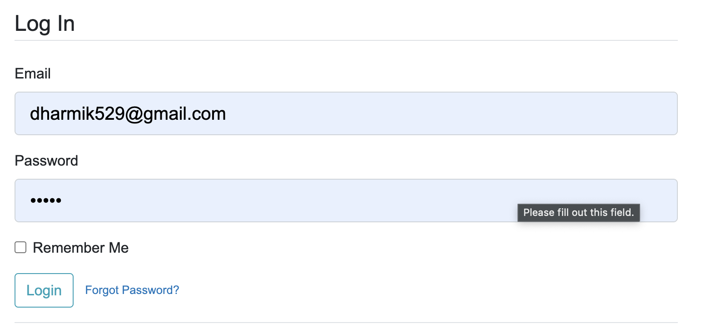

<h1 align="center"> Automated Medication Management System </h1>
<h2 align="center"> ━━━━━━  ❖  ━━━━━━ </h2>
<div align="center">
   <p></p>
   <a href="https://github.com/love-p">
     
   </a>
   <a href="https://github.com/dharmik529">
     
   </a>
   </a>
</div>
<h4 align="center"> By Love Patel and Dharmik Patel</h5>


## Installation
### ❖ Pre-Requirements
#### 1. Ensure you have Python 3.11.6 installed. You can download Python 3.11.6 from the official Python website
[Python Downloads page](https://www.python.org/downloads/)

#### 2. Ensure you have Poetry installed and setup on your local machine. You can find the instructions on how to set it up on the Poetry website.
[Python Poetry Installation](https://python-poetry.org/docs/)

### ❖ Installation
#### 1. Clone the repository to your local machine using the following Git command:
```bash
git clone https://github.com/dharmik529/OS_FinalProject.git
```
#### 2. Initialize virtual environment in repository file (required):
In order to see the full web application. There are a few steps you need to complete. First, you have to go into the AMMS folder in order to run the ``run.py``.
```bash
cd OS_FinalProject/AMMS
```
#### 3. In the AMMS activate the virutal env using Poetry
```bash
poetry shell
```

#### 4. Install the packages and dependencies in the virtual env
```bash
poetry install
```
#### 4. To run the whole project, run the command below
```bash
python3 run.py
```

## ❖ Usage Instructions
#### Login & Register System:
- Navigate to the home page.
- Click on "Register" in the top right of the home page.
- Enter the details in the form such as username, email, password
- Once that is done, go to Login and enter the email and password to login.

#### Reminder System:
- There are 2 sections for this. There is a page where you can see all your reminders scheduled, and the form to schedule a new reminder.
- To schedule a new reminder, naviate to the top menu bar in app and click "new reminder"
- Fill out the form accordingly to add the reminder to the database.

#### Medication System:
- Navigate to the home page.
- There are 2 sections for this. There is a page where you can see all your medications, and the form to add a new medication.
- To add a new medication, naviate to the top menu bar in app and click "new medication"
- Fill out the form accordingly to add the medication to the database.

## ❖ Project Overview

The Automated Medication Management System is designed to empower elderly individuals to effectively manage their medication schedules. It features a user-friendly interface that provides reminders for prescribed doses and tracks medication consumption to ensure adherence and overall well-being. This system leverages advanced Operating System concepts like process scheduling and interprocess communication, ensuring timely reminders and seamless coordination between its various components.

This Flask project incorporates several Operating System (OS) concepts:

1. **Threads:** Flask app uses the Werkzeug WSGI server by default which relies on threads to handle incoming HTTP requests. When a request comes in, the server spawns a new thread instead of blocking the main thread or processing sequentially. This allows multiple clients to connect concurrently. The `reminder_handler` function likely executes within a dedicated thread spawned by the scheduler. This enables it to run independently and concurrently with the web server threads.

   In summary, threads promote concurrency for the web server, background jobs, and database access. The GIL and synchronization primitives ensure thread safety. 

2. **Process Management**: The Flask application creates a web server process to handle HTTP requests from users. This allows multiple users to interact with the web app simultaneously through isolated processes per client connection. When a request comes in, a thread is allocated from the process thread pool to handle execution. In addition, the background reminder_handler function runs as a separate continually executing process for scheduling notifications. This allows reminders to run independently from the main web server workload. Python's GIL allows these multi-processed workflows.

3. **File Handling:** Reading and writing sqlite.db files to store and retrieve reminders, medications, and user data. This gives each user their own unique page that is tailored to their needs, and allows for a more variable usage.

4. **Synchronization:** Implementing locks to manage access to shared resources (e.g., reminders and medications) to avoid data corruption when multiple threads access them concurrently. This allows for better access to medications and reminders in a time priority manner.

5. **Inter-Process Communication (IPC):** Using HTTP methods like POST, GET, and DELETE for communication between the client (browser) and the server (Flask application) to perform actions like adding reminders, deleting records, and retrieving health metrics. The web application process coordinates with the independently executing reminder handler process using an in-memory data structure that acts as a shared queue. When new reminders are added via the web UI, they are appended to this queue accessible by both processes. This queue-based signaling allows loose coupling.

6. **Memory Management**: Python's memory manager implements heap allocation using a private heap space per interpreter process. When objects like medication log entries are created, memory is allocated on the heap. Periodic garbage collection frees up unused memory by releasing objects no longer referenced. This prevents leaks over long-running processes. Flask's stack manages request context data lifecycles.


## ❖ Project Goals
The goal of this project is to create a software application that enhances the happiness and well-being of elderly individuals by aiding in their medication management. This involves applying knowledge and skills acquired in CMPSC 472 to develop a practical, user-friendly solution.

1. **Enhance Medication Management with Secure User Authentication:**
    - **Objective:** Implement robust user authentication using Flask-Login to enable elderly users to securely sign up and log in. This ensures a safe and personalized environment for managing medication schedules and reminders.
    - **Rationale:** Empower elderly individuals in medication management, alleviating stress associated with memory challenges and providing a tailored, secure user experience.

2. **Facilitate Comprehensive Medication Tracking:**
    - **Objective:** Develop a sophisticated system for tracking and recording medication details, encompassing medication name, dose, date, and time. This empowers users to actively monitor and manage their medication history.
    - **Rationale:** Promote proactive health management and assist users in adhering to medication schedules for improved overall well-being.

3. **Craft an Intuitive and Accessible User Interface:**
    - **Objective:** Design a visually appealing and user-friendly graphical interface (GUI) that caters to the specific needs of elderly users. The goal is to ensure ease of use, accessibility, and inclusivity.
    - **Rationale:** Address varying levels of technological familiarity among elderly individuals, making the application inviting and accommodating.

4. **Implement Robust Data Storage for Medication and Reminders:**
    - **Objective:** Develop robust mechanisms for persistent storage of medication and reminder data. This enables users to access historical information, ensuring continuity of care.
    - **Rationale:** Guarantee that users can review past medication details and reminders, facilitating long-term health tracking and personalized care.

5. **Support Collaborative Caregiver Engagement:**
    - **Objective:** Provide features enabling caregivers to remotely view and manage medication-related information. This fosters collaboration and support for elderly individuals in their medication management.
    - **Rationale:** Involve caregivers in the well-being of users, creating a collaborative approach to medication management and health tracking.

6. **Promote Mental Health Awareness through Thoughtful Reminders:**
    - **Objective:** Implement features that encourage users and caregivers to stay aware of mental health through proactive reminders and insights derived from health data trends.
    - **Rationale:** Contribute to a holistic well-being approach by promoting mental health awareness alongside considerations for physical health.

7. **Address Digital Inclusivity for Older Users:**
    - **Objective:** Introduce technology in a manner that is accessible and welcoming to older individuals, bridging the digital divide and fostering a sense of inclusivity.
    - **Rationale:** Promote social connection, reduce isolation, and encourage elderly users to engage with modern tools for their benefit.

8. **Establish a Collaborative Health Management Ecosystem:**
    - **Objective:** Create a platform that encourages collaboration among users, caregivers, and potentially healthcare professionals. This aims to establish a supportive health ecosystem.
    - **Rationale:** Ensure a comprehensive approach to health management, involving multiple stakeholders for the benefit of elderly individuals and fostering a sense of community.


## ❖ Project Significance
This project is significant as it addresses a real-world problem faced by many elderly individuals - managing complex medication schedules. By providing a tool that assists in this task, the project contributes to the overall health and well-being of its users, ultimately enhancing their quality of life.

1. **Empowering Medication Independence:**
    - The robust user authentication system, implemented using Flask-Login, empowers elderly users to independently manage their medications. The secure sign-up and login process ensures a personalized and private space for users to create and adhere to their medication schedules.

2. **Comprehensive Medication Tracking:**
    - The project's sophisticated system for medication tracking, implemented in the `Medication` model, allows users to record and review detailed medication information, including name, dose, date, and time. This feature contributes to a comprehensive approach to health management.

3. **Accessible User Interface for the Elderly:**
    - The design of an intuitive graphical user interface (GUI) caters specifically to the needs of elderly users, promoting accessibility and inclusivity. This user-friendly interface ensures that individuals with varying levels of technological familiarity can easily navigate and utilize the application.

4. **Persistent Data Storage for Continuity of Care:**
    - The implementation of persistent data storage mechanisms ensures that users can access historical medication and reminder data. This feature, seen in the usage of SQLAlchemy in the `Medication` and `Reminder` models, facilitates continuity of care and supports long-term health tracking.

5. **Remote Caregiver Collaboration:**
    - Features enabling caregivers to remotely view and manage medication-related information enhance collaborative care. The implementation allows caregivers to actively participate in the well-being of users, providing support and assistance as needed.

6. **Promoting Mental Health Awareness:**
    - The project's emphasis on mental health awareness is evident through features that encourage users and caregivers to stay aware of mental health. Proactive reminders and insights derived from health data trends contribute to a holistic approach to well-being.

7. **Addressing the Digital Divide:**
    - The introduction of technology in an accessible manner bridges the digital divide for older individuals. This not only facilitates technology adoption but also promotes social connection, reducing feelings of isolation among elderly users.

8. **Creating a Supportive Health Ecosystem:**
    - The collaborative features in the project establish a supportive health ecosystem. Involving caregivers and potentially healthcare professionals ensures a comprehensive and well-rounded approach to health management, benefiting the elderly user community.

In summary, this project is not merely a technical solution but a compassionate and tailored initiative that directly addresses the unique challenges faced by the elderly population. Its significance lies in offering practical solutions that improve overall health, autonomy, and the quality of life for users, making a positive and meaningful impact on the community it serves.


## ❖ Code Structure
### User Blueprint

#### `forms.py`

- Manages user-related forms for registration, login, account update, password reset, and reset confirmation.
- Utilizes Flask-WTF for form creation and validation.
- Forms include:
  - `RegistrationForm`: Handles user registration.
  - `LoginForm`: Manages user login.
  - `UpdateAccountForm`: Allows users to update their account details.
  - `RequestResetForm`: Manages the request for password reset.
  - `ResetPasswordForm`: Handles the password reset process.

#### `routes.py`

- Manages user-related routes for registration, login, logout, account management, password reset, and reset confirmation.
- Utilizes Flask routes for defining endpoints.
- Routes include:
  - `/register`: Handles user registration.
  - `/login`: Manages user login.
  - `/logout`: Allows users to log out.
  - `/account`: Handles user account management.
  - `/reset_password`: Manages the request for password reset.
  - `/reset_password/<token>`: Handles the password reset confirmation.

### Medication Blueprint

#### `forms.py`

- Manages forms related to medication, specifically for adding new medications.
- Utilizes Flask-WTF for form creation and validation.
- Forms include:
  - `NewMedicationForm`: Allows users to input details for a new medication.

#### `routes.py`

- Manages medication-related routes for viewing all medications, adding new medications, and deleting medications.
- Utilizes Flask routes for defining endpoints.
- Routes include:
  - `/allMed`: Displays a list of all medications.
  - `/newMed`: Handles the addition of a new medication.
  - `/deleteMed/<int:id>`: Manages the deletion of a medication.

### Reminder Blueprint

#### `routes.py`

- Manages routes related to reminders, including viewing reminders and adding new ones.
- Utilizes Flask routes for defining endpoints.
- Routes include:
  - `/reminderHome`: Displays a list of reminders.
  - `/add_reminder`: Manages the addition of a new reminder.

### Main Application (`amms`)

#### `__init__.py`

- Initializes the Flask application and connects it with the database, bcrypt, and Flask-Login.
- Registers blueprints for user, main, medication, and reminder functionalities.
- Starts a separate thread for a reminder handler, allowing for asynchronous reminder notifications.

### Database Models

- `User`: Defines the structure of the user database table for storing user information.
- `Medication`: Defines the structure of the medication database table for storing medication details.
- `Reminder`: Defines the structure of the reminder database table for storing reminder data.

### Core Configurations

- Utilizes Flask extensions such as Flask-SQLAlchemy, Flask-Bcrypt, and Flask-Login for essential functionalities.
- `Config` class manages configuration settings for the application.

### Healthcare Management System Logic

- Core logic for managing healthcare-related functionalities is distributed across the user, medication, and reminder blueprints.
- Each blueprint encapsulates related functionalities, ensuring a modular and organized code structure.

### Front-end
- With the use of the `templates` and the `styles` folder. This flask application offers a user-friendly front-end interface, which allows for the elderly to navigate through different pages, operating different tasks such as reminders, medications, etc.

### Explanations

- **Blueprints and Routes:**
  - Blueprints in Flask help modularize the application, allowing for separation of concerns. Each blueprint handles specific functionalities.
  - Routes define the endpoints where users can access different features and functionalities.

- **Forms:**
  - Flask-WTF forms ensure data integrity and security by validating and processing user inputs before interacting with the database.

- **Database Models:**
  - Models define the structure of database tables, enabling efficient storage and retrieval of data. SQLAlchemy facilitates database interactions.

- **Core Configurations:**
  - Utilizes Flask extensions to enhance the core functionalities of the application.

- **Threading:**
  - Implements threading to handle asynchronous tasks, such as the reminder handler running in the background.

- **Code Flow:**
  - The application follows a logical flow where users can navigate through routes to perform actions such as authentication, medication management, and reminder creation.

This structure ensures a modular, organized, and maintainable codebase, making it easier to extend and enhance the functionality of the healthcare management system. Each component has a well-defined responsibility, contributing to a cohesive and scalable application architecture.


## ❖ Functionality and Test Results
### 1. User Authentication:

#### Functionality:
- **Objective:** Implement user signup and login functionality using Flask-Login.
- **Details:** Users can register an account, log in, and access personalized features.

#### Test Results:

**Test 1: User Registration**
- **Steps:**
  1. Navigate to the registration page.
  2. Fill in valid registration details.
  3. Click the "Sign Up" button.
- **Expected Result:** User account is created, and a success message is displayed.


**Test 2: User Login**
- **Steps:**
  1. Navigate to the login page.
  2. Enter valid login credentials.
  3. Click the "Login" button.
- **Expected Result:** User is successfully logged in, and the home page is displayed.



### 2. Medication Management:

#### Functionality:
- **Objective:** Enable users to add, view, and delete medications.
- **Details:** Users can input medication details, view a list of medications, and delete entries.

#### Test Results:

**Test 3: Add New Medication**
- **Steps:**
  1. Access the "New Medication" page.
  2. Fill in medication details.
  3. Click the "Enter" button.
- **Expected Result:** The medication is added, and a success message is shown.


**Test 4: View Medication List**
- **Steps:**
  1. Navigate to the "All Medications" page.
- **Expected Result:** A paginated list of medications is displayed.


**Test 5: Delete Medication**
- **Steps:**
  1. Click on the "Delete" button next to a medication entry.
- **Expected Result:** The selected medication is deleted, and a success message is shown.


### 3. Reminder System:

#### Functionality:
- **Objective:** Implement a reminder system for medication schedules.
- **Details:** Users receive reminders at specified times for their medication.

#### Test Results:

**Test 6: Add Reminder**
- **Steps:**
  1. Access the "Add Reminder" functionality.
  2. Set a reminder time and message.
  3. Click the "Add Reminder" button.
- **Expected Result:** The reminder is added, and the user receives a notification at the specified time.


**Test 7: Reminder Notification**
- **Steps:**
  1. Wait for a scheduled reminder time.
- **Expected Result:** A system notification is displayed with the reminder message.


### 4. User Account Management:

#### Functionality:
- **Objective:** Enable users to update their account details.
- **Details:** Users can modify their username and email.

#### Test Results:

**Test 8: Update Account Details**
- **Steps:**
  1. Access the "Account" page.
  2. Modify username or email.
  3. Click the "Update" button.
- **Expected Result:** The account details are updated, and a success message is displayed.

## ❖ Discussion and Conclusions

## ❖ Discussion and Conclusions

### Project Issues and Limitations:

#### Authentication Security:
- While the project implements user authentication, it's crucial to continually monitor and update security measures. Regular security audits and the incorporation of additional layers, such as two-factor authentication, could enhance user account protection.

#### Reminder Notification Reliability:
- The reminder notification system, relying on subprocess calls and periodic checks, may face reliability issues, especially in high-traffic scenarios. Exploring more robust notification mechanisms and handling edge cases could enhance the reliability of reminders.


### Application of Course Learnings:

#### Flask Framework Proficiency:
- The project showcases a solid understanding and application of the Flask web framework, leveraging its features such as blueprints, routes, forms, and database models effectively. This proficiency reflects the successful assimilation of course learnings.

#### Database Design and ORM:
- The use of SQLAlchemy for database management and ORM principles is evident in the well-defined models for users, medications, and reminders. Understanding how to structure and interact with databases aligns with the database design principles covered in the course.

#### Threading for Background Tasks:
- The implementation of threading for the reminder handler demonstrates the application of concurrent programming concepts. This aligns with the course teachings on handling background tasks asynchronously to maintain a responsive application.

#### User Authentication with Flask-Login:
- The incorporation of Flask-Login for user authentication reflects an understanding of secure user management. Utilizing Flask-Login aligns with the course emphasis on implementing secure authentication mechanisms in web applications.

### Future Improvements:

#### Enhanced Medication Tracking:
- Introduce more advanced medication tracking features, such as dosage history and adherence statistics. This could provide users with a comprehensive overview of their medication management.

#### Integration of Health Metrics:
- Extend the application to include the tracking of additional health metrics beyond medication, such as blood pressure, heart rate, and other relevant data. This expansion aligns with the goal of creating a holistic health management system.

#### User Interface Refinement:
- Invest in further refining the user interface to ensure a seamless and intuitive user experience. Incorporate user feedback to enhance usability and accessibility, especially for elderly users.

#### Robust Testing Suite:
- Develop a comprehensive testing suite covering unit tests, integration tests, and end-to-end tests. This will help identify and address potential issues early in the development process, contributing to a more reliable and maintainable application.

#### Collaborative Features:
- Explore features that facilitate collaboration among users, caregivers, and healthcare professionals. This could involve secure data sharing, real-time updates, and communication functionalities to create a collaborative health ecosystem.

#### Automated Testing and Continuous Integration:
- Implement automated testing and continuous integration practices to streamline the development process. This ensures that new code changes are thoroughly tested and integrated seamlessly, reducing the risk of introducing bugs.

#### Machine Learning for Adherence Prediction:
- Consider integrating machine learning algorithms to predict medication adherence based on historical data. This predictive capability could provide proactive reminders and insights into potential adherence challenges.

#### Accessibility Considerations:
- Place a strong emphasis on accessibility considerations, especially for elderly users. Ensure that the application complies with accessibility standards, making it inclusive and usable for individuals with diverse needs.

In conclusion, while the project demonstrates a solid foundation, future improvements can further elevate its capabilities, user experience, and overall impact on healthcare management. Addressing identified limitations and embracing continuous improvement will contribute to the project's long-term success and relevance.
